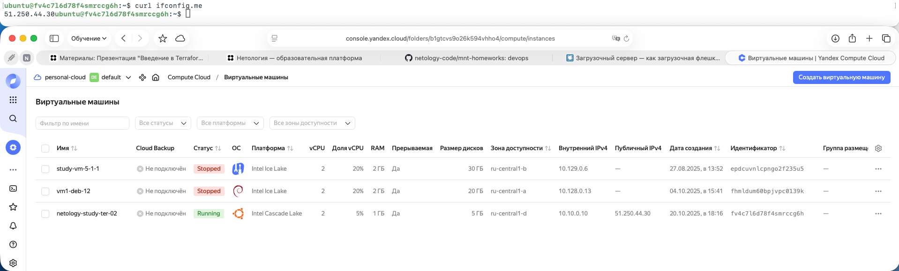

# Домашнее задание к занятию «Основы Terraform. Yandex Cloud»


Выполнил только все обязательные задания 1-6.

### Задание 1
В качестве ответа всегда полностью прикладывайте ваш terraform-код в git.
Убедитесь что ваша версия **Terraform** ~>1.8.4

1. Изучите проект. В файле variables.tf объявлены переменные для Yandex provider.
2. Создайте сервисный аккаунт и ключ. [service_account_key_file](https://terraform-provider.yandexcloud.net).
4. Сгенерируйте новый или используйте свой текущий ssh-ключ. Запишите его открытую(public) часть в переменную **vms_ssh_public_root_key**.
5. Инициализируйте проект, выполните код. Исправьте намеренно допущенные синтаксические ошибки. Ищите внимательно, посимвольно. Ответьте, в чём заключается их суть.

  1 ошибка: 
    Error: Error while requesting API to create instance: client-request-id = a0444280-b44d-419f-9da7-d85e3e1b2b84 client-trace-id = d53beb2a-5199-48ee-b2fb-db5f7c1720c2 rpc error: code = FailedPrecondition desc = Platform "standart-v4" not found
    Тут очепятка и в YC нет платформы standart-v4, использую standard-v2 = Intel Cascade Lake.

  2 ошибка:
    Error: Error while requesting API to create instance: client-request-id = 1362beee-1e55-48b0-acef-fc028f73b548 client-trace-id = 0aff6c5e-6b84-4c02-ac32-076e96670703 rpc error: code = InvalidArgument desc = the specified number of cores is not available on platform "standard-v2"; allowed core number: 2, 4
    В main.tf cores = 1, допустимо: 2, 4. Исправил на 2.

6. Подключитесь к консоли ВМ через ssh и выполните команду ```curl ifconfig.me```.
Примечание: К OS ubuntu "out of a box, те из коробки" необходимо подключаться под пользователем ubuntu: ```"ssh ubuntu@vm_ip_address"```. Предварительно убедитесь, что ваш ключ добавлен в ssh-агент: ```eval $(ssh-agent) && ssh-add``` Вы познакомитесь с тем как при создании ВМ создать своего пользователя в блоке metadata в следующей лекции.;

  Команда ```curl ifconfig.me``` отдаёт белый адрес ВМ.

7. Ответьте, как в процессе обучения могут пригодиться параметры ```preemptible = true``` и ```core_fraction=5``` в параметрах ВМ.

В качестве решения приложите:

- скриншот ЛК Yandex Cloud с созданной ВМ, где видно внешний ip-адрес;
- скриншот консоли, curl должен отобразить тот же внешний ip-адрес;
- ответы на вопросы.

    
    Параметр ```preemptible = true``` означает, что ВМ будет прерываемая, параметр ```core_fraction=5``` опеределяет гарантированную долю vCPU которая будет выделена ВМ. Оба параметра позволяют  сэкономить и максимально эффективно использовать грант выданный для обучения.


### Задание 2

1. Замените все хардкод-**значения** для ресурсов **yandex_compute_image** и **yandex_compute_instance** на **отдельные** переменные. К названиям переменных ВМ добавьте в начало префикс **vm_web_** .  Пример: **vm_web_name**.
2. Объявите нужные переменные в файле variables.tf, обязательно указывайте тип переменной. Заполните их **default** прежними значениями из main.tf. 
3. Проверьте terraform plan. Изменений быть не должно. 

    Создал переменные: "vm_web_family", "vm_web_cpu_core", "vm_web_cpu_fraction", "vm_web_ram", "vm_web_platform", "vm_web_name".

### Задание 3

1. Создайте в корне проекта файл 'vms_platform.tf' . Перенесите в него все переменные первой ВМ.
2. Скопируйте блок ресурса и создайте с его помощью вторую ВМ в файле main.tf: **"netology-develop-platform-db"** ,  ```cores  = 2, memory = 2, core_fraction = 20```. Объявите её переменные с префиксом **vm_db_** в том же файле ('vms_platform.tf').  ВМ должна работать в зоне "ru-central1-b"
3. Примените изменения.


### Задание 4

1. Объявите в файле outputs.tf **один** output , содержащий: instance_name, external_ip, fqdn для каждой из ВМ в удобном лично для вас формате.(без хардкода!!!)
2. Примените изменения.

В качестве решения приложите вывод значений ip-адресов команды ```terraform output```.

  terraform output
    output_task_4 = {
      "netology-develop-platform-db" = {
        "external_ip" = "84.201.138.42"
        "fqdn" = "netology-develop-platform-db.ru-central1.internal"
        "instance_name" = "netology-develop-platform-db"
      }
      "netology-develop-platform-web" = {
        "external_ip" = "158.160.180.242"
        "fqdn" = "netology-develop-platform-web.ru-central1.internal"
        "instance_name" = "netology-develop-platform-web"
      }
    }


### Задание 5

1. В файле locals.tf опишите в **одном** local-блоке имя каждой ВМ, используйте интерполяцию ${..} с НЕСКОЛЬКИМИ переменными по примеру из лекции.
2. Замените переменные внутри ресурса ВМ на созданные вами local-переменные.
3. Примените изменения.


### Задание 6

1. Вместо использования трёх переменных  ".._cores",".._memory",".._core_fraction" в блоке  resources {...}, объедините их в единую map-переменную **vms_resources** и  внутри неё конфиги обеих ВМ в виде вложенного map(object).  
   ```
   пример из terraform.tfvars:
   vms_resources = {
     web={
       cores=2
       memory=2
       core_fraction=5
       hdd_size=10
       hdd_type="network-hdd"
       ...
     },
     db= {
       cores=2
       memory=4
       core_fraction=20
       hdd_size=10
       hdd_type="network-ssd"
       ...
     }
   }
   ```
2. Создайте и используйте отдельную map(object) переменную для блока metadata, она должна быть общая для всех ваших ВМ.
   ```
   пример из terraform.tfvars:
   metadata = {
     serial-port-enable = 1
     ssh-keys           = "ubuntu:ssh-ed25519 AAAAC..."
   }
   ```  
  
3. Найдите и закоментируйте все, более не используемые переменные проекта.
4. Проверьте terraform plan. Изменений быть не должно.

    Т.к., в примере используется прямая передача публичного ssh ключа, а у меня ключ берётся из файла и в переменной нельзя использовать функции, то сделал следующее:
    В locals добавил metadata_full которая объединяет переменные "metadata" и "vms_ssh_root_key", и выполняет функцию file для последней, извлекая ключ из файла. 
------

## Дополнительное задание (со звёздочкой*)

**Настоятельно рекомендуем выполнять все задания со звёздочкой.**   
Они помогут глубже разобраться в материале. Задания со звёздочкой дополнительные, не обязательные к выполнению и никак не повлияют на получение вами зачёта по этому домашнему заданию. 


------
### Задание 7*

Изучите содержимое файла console.tf. Откройте terraform console, выполните следующие задания: 

1. Напишите, какой командой можно отобразить **второй** элемент списка test_list.
2. Найдите длину списка test_list с помощью функции length(<имя переменной>).
3. Напишите, какой командой можно отобразить значение ключа admin из map test_map.
4. Напишите interpolation-выражение, результатом которого будет: "John is admin for production server based on OS ubuntu-20-04 with X vcpu, Y ram and Z virtual disks", используйте данные из переменных test_list, test_map, servers и функцию length() для подстановки значений.

**Примечание**: если не догадаетесь как вычленить слово "admin", погуглите: "terraform get keys of map"

В качестве решения предоставьте необходимые команды и их вывод.

------

### Задание 8*
1. Напишите и проверьте переменную test и полное описание ее type в соответствии со значением из terraform.tfvars:
```
test = [
  {
    "dev1" = [
      "ssh -o 'StrictHostKeyChecking=no' ubuntu@62.84.124.117",
      "10.0.1.7",
    ]
  },
  {
    "dev2" = [
      "ssh -o 'StrictHostKeyChecking=no' ubuntu@84.252.140.88",
      "10.0.2.29",
    ]
  },
  {
    "prod1" = [
      "ssh -o 'StrictHostKeyChecking=no' ubuntu@51.250.2.101",
      "10.0.1.30",
    ]
  },
]
```
2. Напишите выражение в terraform console, которое позволит вычленить строку "ssh -o 'StrictHostKeyChecking=no' ubuntu@62.84.124.117" из этой переменной.
------

------

### Задание 9*

Используя инструкцию https://cloud.yandex.ru/ru/docs/vpc/operations/create-nat-gateway#tf_1, настройте для ваших ВМ nat_gateway. Для проверки уберите внешний IP адрес (nat=false) у ваших ВМ и проверьте доступ в интернет с ВМ, подключившись к ней через serial console. Для подключения предварительно через ssh измените пароль пользователя: ```sudo passwd ubuntu```

### Правила приёма работыДля подключения предварительно через ssh измените пароль пользователя: sudo passwd ubuntu
В качестве результата прикрепите ссылку на MD файл с описанием выполненой работы в вашем репозитории. Так же в репозитории должен присутсвовать ваш финальный код проекта.

**Важно. Удалите все созданные ресурсы**.


### Критерии оценки

Зачёт ставится, если:

* выполнены все задания,
* ответы даны в развёрнутой форме,
* приложены соответствующие скриншоты и файлы проекта,
* в выполненных заданиях нет противоречий и нарушения логики.

На доработку работу отправят, если:

* задание выполнено частично или не выполнено вообще,
* в логике выполнения заданий есть противоречия и существенные недостатки. 

