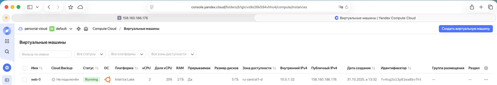
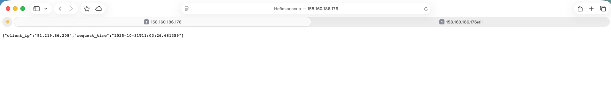
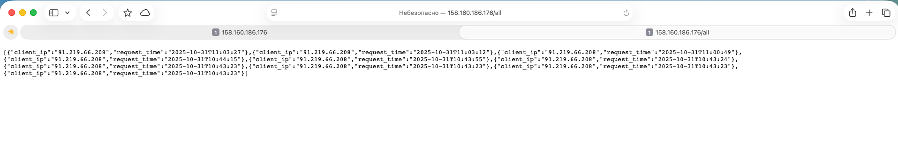

### Описание выполненного проекта

## Структура проекта

    project/
    │
    ├── src/   # Terraform-проект
    │
    └── app/   # Исходники FastAPI-приложения

Проект представляет собой инфраструктуру и веб-приложение, разворачиваемое с помощью Terraform, Docker, и сервисов Yandex Cloud.
Приложение реализовано на FastAPI, подключается к базе данных MySQL Managed Service, а пароли хранятся в Yandex Lockbox.

Предварительно был создан Yandex Lockbox и создан серкрет, где хранятся пары:

    db_user = connect
    db_password = <пароль>

Доступ к секрету имеет сервисный аккаунт, под которым выполняется код Terraform.

Создан Terraform-проект (src/), который поднимает базовую инфраструктуру:

    Сеть и подсеть (VPC, Subnet)
    Security Group с разрешением доступа по портам 22, 80, 443, 3306
    Кластер MySQL Managed Service
    База данных и пользователь
    Container Registry для хранения Docker-образов
    Собирает docker-образ и пушит в Container Registry
        Dockerfile веб-приложения (app/)
        Реализовано приложение на FastAPI, которое:
        Определяет IP клиента,
        Записывает IP и время запроса в таблицу MySQL,
        Возвращает пользователю эти данные в JSON-формате.
        После сборки контейнер публикуется в Yandex Container Registry.
    Виртуальная машина (web) с автоматической установкой Docker через cloud-init

Для ВМ web используется cloud-init, который:
Устанавливает Docker.
Авторизуется в Container Registry.
Тянет нужный образ приложения.
Запускает контейнер с переменными окружения для подключения к БД.

 
 

